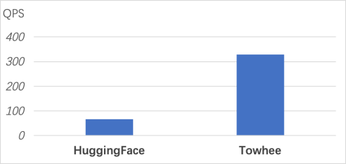

# Triton in Towhee

[Triton](https://github.com/triton-inference-server) is an inference serving software that streamlines AI inferencing, and Towhee uses Triton to provide model inference and acceleration. 

For example, we tested the performance of two CLIP pipelines on the same machine (64 cores, GeForce RTX 3080), one based on HuggingFace and the other using Towhee&Triton, Towhee is 5x faster than Huggingface.



## Prerequisites

- [Towhee](https://github.com/towhee-io/towhee)
- [Docker](https://docs.docker.com/engine/install/)

## Example

There is an example of using towhee to start a triton server with an [image embedding](https://towhee.io/tasks/detail/operator?field_name=Computer-Vision&task_name=Image-Embedding) pipeline, you can also refer to this to start your own pipeline.

- **Create Pipeline and Build Image**

`dummy_input()` is used to create a pipeline with dummy inputs, and `as_function` can turn the pipeline into a function, which includes DAG information so that we can build triton docker image.

```Python
import towhee
img_embedding_pipe = ( towhee.dummy_input()
        .image_decode.cv2_rgb()
        .image_embedding.timm(model_name='resnet50')
        .as_function()
        )

towhee.build_docker_image(img_embedding_pipe, image_name='image_embedding:v1', cuda='11.4')
```

Then we can run `docker images` command and will list the built **image_embedding:v1** image.

- **Start Triton Server**

Run docker image with `tritonserver` command to start triton server.

```Bash
$ docker run -td --gpus=all --shm-size=1g --net=host image_embedding:v1 \
    tritonserver --model-repository=/workspace/models --grpc-port=8001
```

After starting the server, we can run `docker logs <container id>` to view the logs. When you see the following logs, it means that the server started successfully:

```bash
Started GRPCInferenceService at 0.0.0.0:8001
Started HTTPService at 0.0.0.0:8000
Started Metrics Service at 0.0.0.0:8002
```

- **Remote Serving with DC**

The we can use `remote` to request the result with the url.

> The url format is your-ip-address:your-grpc-port, you need modify the ip according you env.

```Python
import towhee
res = towhee.dc(['https://github.com/towhee-io/towhee/blob/main/towhee_logo.png?raw=true']) \
            .remote(url='172.16.70.4:8001', mode='infer', protocol='grpc')
```

## Advanced

- **Pipeline Configuration**

Using `pipeline_config` interface to set the Pipeline configuration, such as parallel, chunksize, jit and format_priority, it will works on this pipeline(all operators). 

For example, this pipeline set the priority to optimize the model, first tensorrt then onnx:

```python
clip_img_embedding_pipe = ( towhee.dummy_input()
        .pipeline_config(format_priority=['tensorrt', 'onnx'])
        .image_decode.cv2_rgb()
        .image_text_embedding.clip_image()
        .as_function()
        )
```

- **Operator Configuration**

Using `op_config` parameter in each Operator to set the configuration, such as `parallel`, `chunksize`, `jit`, `format_priority`, `dynamic_batching`, `device_ids` and `instance_count`. 

For example, this pipeline set two instances to run `image_decode.cv2_rgb` operator, and set device (GPU0) to run `image_text_embedding.clip_image` operator:

```python
clip_img_embedding_pipe = ( towhee.dummy_input()
        .image_decode.cv2_rgb(op_config={'instance_count': 2})
        .image_text_embedding.clip_image(op_config={'device_ids': [0]})
        .as_function()
        )
```

And this pipeline will use [towhee.compiler](https://github.com/towhee-io/towhee-compiler) to JIT(just in time) compile the resnet50 model for speedup:

```python
img_embedding_pipe = ( towhee.dummy_input()
        .image_decode.cv2_rgb()
        .image_embedding.timm(model_name='resnet50', op_config={'jit': 'towhee'})
        .as_function()
        )
```

- **Docker Configuration**

You can set the [Docker Command Options](https://docs.docker.com/engine/reference/commandline/run/) when start triton server, such as set gpus and she-size.

## Q&A

1. **Why the docker image is very large?**

   The base image (nvidia/tritonserver) itself is large, and there are many packages related to the package model (PyTorch, Onnxruntime, etc.) that need to be installed.

2. **How to debug my pipeline in triton?**

   Once you have started triton server, you can run into the container to modify the code with `docker exec -ti <container_id> bash` command, and then manually start the triton service in container with `tritonserver --model-repository=/workspace/models --grpc-port=<your-port>`.

   